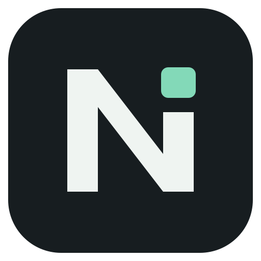

<div align="center">



# UE Node Nexus MCP

**通过 MCP 查询、编辑和验证 Unreal Engine 项目。**

*文本资产编辑，独立工作区与版本历史，语义合并，编辑器内编译与回读。*


</div>

---

## 简述

UE 材质、蓝图等资产包含大量节点、引脚和属性。传统的 MCP 逐节点读写模式会让这些结构反复以 JSON 进入模型上下文，一次编辑也可能拆成多次工具调用；图越大，上下文占用、调用开销和维护中间状态的成本越高。

因此，项目增加了 **本地解码层**：由 UE 导出真实资产结构，Python 在本地将其转换为紧凑的 `.nexus` 文本，并负责校验、计算差异和生成执行计划。AI 编辑文本，UE 应用差异、编译并回读结果，完整导出与节点映射保留在本地。MCP 仍承担调度和诊断反馈，资产编辑则通过文本差异批量提交，减少重复传输与逐项调用，也让修改可以审阅、失败可以恢复。

**0.5.0** 在解码层上加入本地协作版本库：每个 agent 使用独立工作区，暂存和提交自己的修改；发布时依据共同祖先合并当前 UE 内存状态，返回可持久保存的逐字段冲突。历史、分支、标签和回退通过同一个 `ue_sync` 入口使用。当前 UE、插件和项目的参数目录统一落入 schema，模型与校验器读取相同 JSON。

**0.6.0 / 契约 4** 增加用户级实例管理：不同工作区操作同一物理 `.uproject` 时复用编辑器，统一启动仲裁、使用租约、闲置回收和退出检查。早期 Guard 阻止普通编辑器重复启动；用户已有编辑器保留其所有权。

> [!NOTE]
> **运行环境**
>
> 当前验证平台为 Windows x64、Unreal Engine 5.5 和 Python 3.11+。MCP 服务与编辑器通过本机命名管道通信，插件需要按目标引擎版本编译。

## 功能

| 功能 | 内容 |
|:-----|:-----|
| **文本资产镜像** | Material、MaterialFunction、MaterialInstance、Blueprint、Niagara System 和属性型资产的导出、校验、差异计划与提交 |
| **场景组镜像** | 当前世界已加载 Actor、蓝图 Actor、ISM/HISM 的稳定身份、文本编辑、批量实例操作、事务和外部包保存 |
| **多 agent 协作** | 独立工作区、HEAD/index/files、三方语义合并、持久冲突会话、带 revision 条件的 UE 发布 |
| **共享编辑器生命周期** | 同项目复用、启动防重、跨会话租约、自动闲置回收、脏包与任务退出保护、资源和日志限额 |
| **本地版本历史** | commit、log/show/diff/blame、branch/tag、restore/revert/reset、stash、cherry-pick/rebase/amend 和 reflog |
| **统一参数目录** | 按蓝图、材质、Niagara、场景、资产及通用类型分类的 schema JSON、Markdown 索引、定向函数与上下文查询 |
| **资产查询与管理** | 资产索引、元数据、依赖与引用关系，以及创建、复制、移动、重命名、删除和 redirector 修复 |
| **图与蓝图** | 节点、引脚、连接、变量、组件、函数，以及动画蓝图与状态机摘要 |
| **关卡操作** | Actor、变换、组件属性、材质槽、Landscape LayerInfo、关卡切换、视口相机与截图 |
| **VFX** | Niagara 发射器、模块栈、渲染器和用户参数；Cascade 系统摘要 |
| **诊断与批处理** | 编译诊断、MessageLog、日志尾、离线材质检查、批量执行和后台任务 |

七个 MCP 门面保持不变。实例管理通过 `ue_execute` 的 `bridge_instance_*` 操作提供，协作通过 `ue_sync` 扩展动作提供。内部操作默认索引不列出，仍可按名查询 schema 和调用。入口为 [operations.json](src/ue_node_nexus_mcp/operations.json)，具体定义在 [operations/](src/ue_node_nexus_mcp/operations/) 内按能力组维护。

---

## 安装

### 使用发行包

[Release 页面](https://github.com/zushinzackery2-ship-it/UE-Node-Nexus-MCP/releases) 提供已发布制品；当前工作树版本为 0.6.0。使用同一次构建的 UE 5.5 Windows x64 插件 ZIP、Python Wheel 和校验文件。目标编辑器完成保存并退出后，安装插件与 Wheel。实例管理要求 Bridge 插件内同时包含 Core 和 Guard DLL；VFX 插件按需要启用：

```bat
py -3 -m venv .venv
.venv\Scripts\python.exe -m pip install ue_node_nexus_mcp-0.6.0-py3-none-any.whl
```

源码安装与构建流程如下。

### 1. 获取源码和 Python 服务

```bat
git clone https://github.com/zushinzackery2-ship-it/UE-Node-Nexus-MCP.git
cd UE-Node-Nexus-MCP
py -3 -m venv .venv
.venv\Scripts\python.exe -m pip install .
```

### 2. 编译 UE 插件

安装 Visual Studio 2022 的 C++ 游戏开发工作负载、MSVC 工具链和 Windows SDK。将 `UE_NEXUS_ENGINE_DIR` 指向本机 UE 5.5 安装目录：

```bat
set "UE_NEXUS_ENGINE_DIR=D:\Unreal\UE_5.5"
tests\compile_check\build_plugins.bat
```

脚本使用 `vswhere` 查找 Visual Studio，在 `build/validation/` 内准备精确源码副本，编译 Guard、Core、VFX 三个模块。DLL 与 `BuildIdentity.json` 位于 `build/validation/Plugins/`；身份文件记录版本、源码指纹、提交、脏状态和契约版本。

关闭目标编辑器，将编译后的插件复制到 UE 工程的 `Plugins/` 目录：

```bat
set "UE_PROJECT_DIR=D:\UEProjects\MyProject"
robocopy "build\validation\Plugins\UeNodeNexusBridge" "%UE_PROJECT_DIR%\Plugins\UeNodeNexusBridge" /E /XD Intermediate
robocopy "build\validation\Plugins\UeNodeNexusVfxBridge" "%UE_PROJECT_DIR%\Plugins\UeNodeNexusVfxBridge" /E /XD Intermediate
```

`UeNodeNexusBridge` 是必需插件；`UeNodeNexusVfxBridge` 用于 Niagara 和 Cascade。重新打开工程，在 Plugins 面板确认所需插件启用。

已有 C++ 工程也可以直接复制仓库中的 `Plugins/` 源码，通过工程自己的构建流程编译。

### 3. 配置 MCP 客户端

将下面路径替换为实际安装目录和 `.uproject`，加入客户端的 MCP 配置。多个工作区配置同一项目即可共享编辑器：

```json
{
  "mcpServers":
  {
    "ue-node-nexus":
    {
      "command": "D:/Tools/UE-Node-Nexus-MCP/.venv/Scripts/ue-node-nexus-mcp.exe",
      "args": ["--response-mode", "minimal", "--project", "D:/UEProjects/MyProject/MyProject.uproject"],
      "env":
      {
        "UE_NEXUS_TIMEOUT_SECONDS": "30"
      }
    }
  }
}
```

重连 MCP 客户端后，使用 `bridge_instance_ensure` 接入已有编辑器；明确传 `mode="reuse_or_start"` 才允许启动缺失项目。可将 [随附 Agent skill](skill/ue-node-nexus-mcp/SKILL.md) 安装到客户端的技能目录。现存旧版编辑器保持受保护状态，完成工作后再升级重启。

---

## 核心 API

| 工具 | 用途 |
|:-----|:-----|
| **`ue_context_get`** | 查看已启用能力、当前编辑器和可用实例 |
| **`ue_capability_get`** | 查询操作索引、请求 schema 或 payload 示例 |
| **`ue_execute`** | 按名称执行类型化 operation |
| **`ue_read`** | 读取资产、图、关卡、诊断等数据；大结果使用 artifact 句柄 |
| **`ue_diff_get`** | 通过 diff token 分页读取变更 |
| **`ue_plan_validate`** | 验证批量操作的参数与执行计划 |
| **`ue_sync`** | 文本工作区、暂存与历史、分支与合并、UE 发布与恢复、schema 查询 |

连接后先检查项目与桥接契约，再查询所需操作的 schema：

```text
ue_context_get(include_counts=true)
ue_execute("bridge_instance_ensure", {"mode": "reuse_or_start", "dry_run": false})
ue_execute("bridge_instance_status", {})
ue_execute("project_context_get", {}, response={"mode": "full"})
ue_execute("bridge_contract_check", {})
ue_capability_get(operation="level_actors_list", detail="schema")
```

`STARTING` 时查询同一实例状态，READY 后执行工作；结束时调用 `bridge_instance_release`。默认使用租约在 300 秒无实际工作后失效，最后一次释放后有 120 秒宽限；心跳和状态查询不会延长使用期限。其他会话、任务、未保存包和恢复事务会阻止退出。完整操作、所有权、共享仓库和升级方法见 [实例管理指南](src/ue_node_nexus_mcp/guides/instances.md)。

`ue_read(target="graph")` 读取材质图，`target="material_instance"` 读取实例参数，`target="auto"` 解析未知资产类型。操作的 `format` 控制数据形状，`response.mode` 控制响应详细程度。

---

## 文本工作区与协作

同一工程的 agent 使用 ensure 返回的共享镜像根与版本库，每个任务分别 `checkout`。已有 UE 仓库绑定优先；新项目默认根为 `<Project>/Saved/Nexus/Content_Transcoded`。工具返回该工作区的 `id`、`files_root` 和 `file_paths`；编辑时以这些路径为准。回收编辑器后，工作区和历史继续支持离线 lint/stage/commit。

```
Content_Transcoded/
├── .nexus/schema/<schema_key>/
│   ├── index.md
│   ├── blueprint/  material/  niagara/
│   └── scene/  asset/  common/  contexts/
└── MyProject/.nexus/collaboration/
    ├── index.sqlite
    ├── objects/
    ├── workspaces/<workspace_id>/files/
    ├── sessions/
    ├── transactions/
    └── locks/
```

| 动作 | 行为 |
|:-----|:-----|
| **`checkout / workspaces / close`** | 创建、查询和关闭独立工作区；分支历史继续保留 |
| **`status / diff / lint`** | 查看暂存与未暂存修改、语义差异、会话和恢复状态，校验文本 |
| **`stage / unstage / commit`** | 暂存资产、撤回暂存、建立本地版本；`commit(all=true)` 捕获并提交指定文件 |
| **`fetch / pull`** | 观察当前 UE / 整合 UE 版本并分别重放暂存与未暂存修改 |
| **`merge / resolve / continue / abort`** | 合并分支、逐项解决冲突、继续或取消持久会话 |
| **`push / recover`** | 将已提交版本合并到当前 UE，按条件应用、保存、记录回执；查询或恢复中断执行 |

修改 refs、工作文件、会话或 UE 的动作默认预览，实际执行传 `dry_run=false`。预览提供 `proposal_id` 时，可在执行中携带它以校验固定输入。`push` 默认读取已提交 HEAD；后续文件编辑仍留在工作区。

```python
a = ue_sync("checkout", paths=["/Game/Materials"], options=dict(dry_run=False, agent_id="A"))
b = ue_sync("checkout", paths=["/Game/Materials"], options=dict(dry_run=False, agent_id="B"))
# 分别编辑 a/b 返回的 file_paths，然后各自提交。
ue_sync("commit", options=dict(workspace_id="<A-id>", all=True, message="调整颜色", dry_run=False))
ue_sync("push", options=dict(workspace_id="<A-id>", dry_run=False))
ue_sync("commit", options=dict(workspace_id="<B-id>", all=True, message="调整粗糙度", dry_run=False))
ue_sync("push", options=dict(workspace_id="<B-id>", dry_run=False))
```

不同字段的兼容修改会合并；同字段竞争返回 `merge_id` 和包含 base/ours/theirs 的冲突。`ours` 表示当前工作区，`theirs` 表示待整合版本或 UE 状态。

```python
ue_sync("show", options=dict(workspace_id="<id>", merge_id="<merge-id>"))
ue_sync("resolve", options=dict(workspace_id="<id>", merge_id="<merge-id>",
    conflict_id="<conflict-id>", choice="ours", dry_run=False))
ue_sync("continue", options=dict(workspace_id="<id>", merge_id="<merge-id>", dry_run=False))
```

新建材质时，在工作区 `files_root` 下写入 `Materials/M_Example.mat.nexus`，`schema` 使用工作区绑定的 key：

```text
nexus: 1
asset: /Game/Materials/M_Example
class: Material
schema: <current-schema-key>

[graph]
value : Constant(R=0.5) @ 0,0
value -> out.Roughness
```

文本仅记录非默认值。删除属性行表示恢复默认值，删除实例参数行表示清除 override；省略贴图属性表示使用引擎默认贴图。完整语法和类型边界见 [文本镜像指南](src/ue_node_nexus_mcp/guides/text_mirror.md)。

### 历史、回退与恢复

| 动作或机制 | 行为 |
|:-----|:-----|
| **`log / show / diff / blame`** | 查询版本父链、提交内容、语义差异与字段来源 |
| **`branch / switch / tag`** | 创建分支、切换干净工作区、标记里程碑 |
| **`restore / revert`** | 从旧版本选择状态，或撤销某次提交的增量；再次 commit/push 才修改 UE |
| **`reset / amend / rebase`** | 修改未发布的私有历史；safety ref 和 reflog 保留原版本 |
| **`cherry-pick / stash / reflog`** | 挑选提交、保存三层草稿、查找引用移动前的版本 |
| **条件发布** | 检查当前内存 revision、editor epoch 和依赖 read set，按当前 UE 到候选状态的差异执行 |
| **持久回执** | `apply_id` 绑定执行请求；响应丢失时查询回执，保存结果进入发布历史 |
| **编辑保护** | 发布期间继续修改文件会保留新字节，并返回 `workspace_rebase_required`；用 pull 整合 |

默认 `stop_on_error=true`；设为 false 时按依赖阻断失败项，结果可能部分完成。删除需要 `allow_delete=true`。已发布历史使用 restore/revert 创建新版本；`recover` 返回执行阶段与恢复证据。

### 可用参数目录

模型可以先读 schema 的 `index.md` 和分类索引，再读一个目标 JSON。记录包含类型、默认值、合法枚举、约束、来源与桥接读写支持；动态引脚或条件未解析时标为 `context_required`。

```python
ue_sync("schema", options=dict(category="material", query="TextureSample", details=True))
ue_sync("schema", options=dict(function="KismetSystemLibrary.PrintString"))
ue_sync("schema", options=dict(target="/Game/Materials/MI_Example.MI_Example"))
ue_sync("schema", options=dict(refresh=True))
```

schema 按项目、引擎、插件和模块身份隔离。定向采集扩展索引，历史快照保留使用过的 schema 记录；离线读取注明新鲜度未知。

首次 checkout 会启用协作并迁移旧基线，旧文本原始字节保存在 `imported` 工作区。启用后修改调用携带 `workspace_id`。旧工程在 checkout 前继续使用原 init/pull/push；其 force 参数按旧契约处理。协作调用使用具体冲突的 resolution。

### 场景与实例

首次导入明确选择的场景组，之后通过 `Scenes/` 内的文件或目录执行相同的同步动作：

```python
ue_sync("checkout", options=dict(dry_run=False, scene=dict(
    map_path="/Game/Maps/World", name="Block",
    actor_paths=["/Game/Maps/World.World:PersistentLevel.Tiles"],
)))
ue_sync("commit", options=dict(workspace_id="<id>", all=True, message="调整场景", dry_run=False))
ue_sync("push", paths=["Scenes/Maps/World/Block.scene.nexus"], options=dict(workspace_id="<id>"))
```

根 Actor 使用世界变换，挂接 Actor、组件和实例使用相对变换。实例 ID 随删除和重排保留；首次写入才绑定编辑器专用元数据。场景提交先处理镜像资产依赖，再应用场景事务，保存涉及的地图、子关卡和外部 Actor 包。完整语法、只读内容及失败恢复见 [场景镜像指南](src/ue_node_nexus_mcp/guides/scene_mirror.md)。分页及直接批量编辑使用 `component_instances_get/patch`。

---

## 配置与排障

| 环境变量 | 默认值 | 用途 |
|:-----|:-----|:-----|
| **`UE_NEXUS_PROJECT_PATH`** | 无 | 精确项目；也可用 `--project` |
| **`UE_NEXUS_TRANSCODE_DIR`** | 已有绑定或 `<Project>/Saved/Nexus/Content_Transcoded` | 首次选择共享镜像根，冲突时返回现有位置 |
| **`UE_NEXUS_RUNTIME_DIR`** | `%LOCALAPPDATA%/UE-Node-Nexus-MCP/Runtime` | 用户级管理状态；普通工作区共用默认值 |
| **`UE_NEXUS_TIMEOUT_SECONDS`** | `30` | 桥接请求超时秒数 |
| **`UE_NEXUS_LOG_DIR`** | `%LOCALAPPDATA%/UE-Node-Nexus-MCP/Logs` | 按请求 ID 记录并轮转 Python 阶段日志 |
| **`UE_NEXUS_RESPONSE_MODE`** | `minimal` | MCP facade 返回 `minimal` 或 `full` |
| **`UE_NEXUS_FEATURES`** | 全部能力组 | 显式启用的组，逗号分隔 |
| **`UE_NEXUS_ENABLE_FEATURES`** | 空 | 追加启用的组 |
| **`UE_NEXUS_DISABLE_FEATURES`** | 空 | 禁用的组 |
| **`UE_NEXUS_VFX_SUPPORT`** | 自动探测 | `true` / `false`，VFX 能力意图 |

| 现象或错误码 | 处理 |
|:-----|:-----|
| **连接立即关闭** | 直接运行 `.venv\Scripts\ue-node-nexus-mcp.exe`；正常情况下等待 stdio 输入。出现导入错误时重新安装包，再重连客户端 |
| **`mcp_bridge_error`** | 检查编辑器进程、插件加载和实例绑定 |
| **`schema_stale`** | 执行 `ue_sync("schema")`，按新 schema 更新文本 |
| **`save_blocked_read_only`** | 先检出资产或恢复文件可写，再重试 |
| **`dependency_not_selected`** | 将所引用的本地新资产加入同一批选择 |
| **`dependency_cycle`** | 检查新资产之间的循环依赖 |
| **`sync_busy`** | 同一镜像根目录已有事务，结束后重试 |
| **`workspace_required`** | checkout 创建独立工作区，后续传 workspace_id |
| **`stale_proposal / stale_session / stale_target`** | 输入发生变化，保留原稿并重新观察、合并与预览 |
| **`identity_conflict`** | 查看相关实体与持久身份，解决会话中的身份冲突后再继续 |
| **`recovery_required`** | 按 apply_id 调用 recover 查看证据与可执行恢复动作 |
| **`bridge_contract_mismatch`** | 根据 capability 的 `build` 核对同版本 Python、Guard/Core/VFX 和 BuildId |
| **`instance_starting / instance_unresponsive`** | 查询既有实例状态和日志，保留同一项目绑定 |
| **`capacity_exceeded`** | 查看受管实例占用、可用内存及回收状态 |
| **`repository_mismatch`** | 接入返回的共享仓库，保留已有历史 |
| **操作与 schema 对不上** | 同步更新 Python 服务与 UE 插件，重启编辑器并重连客户端 |

编译入口共用编译服务，成功状态包含目标 shader 和 RHI 资源更新完成信息。诊断仅检查已加载对象；保存监听在事务结束后处理队列。镜像事务跨线程、跨进程互斥，场景回读用请求标识匹配提交。上述机制约束桥接生命周期；引擎断言和 GPU 驱动故障仍属于同进程故障边界，详见 [诊断指南](src/ue_node_nexus_mcp/guides/diagnostics_repair.md)。

---

## 目录与开发

```
UE-Node-Nexus-MCP/
  assets/branding/         项目标识、透明标记和单色 SVG
  Plugins/
    UeNodeNexusBridge/       Guard 早期门禁及核心编辑器插件
    UeNodeNexusVfxBridge/    VFX 插件
  src/ue_node_nexus_mcp/
    operations.json        操作定义索引
    operations/            按能力组划分的操作定义
    build_info/            三模块构建身份与契约校验
    coordination/          通用 OS 锁与控制管道
    instances/             身份、Broker、租约、作用域、回收与仓库绑定
    diagnostics/           独立会话日志和总量保留策略
    guides/                客户端可查询的工作流指南
    transcode/             文本解析、schema、diff 和同步
      collaboration/       store、history、workspace、semantic、merge、apply、report
      schema/              分类参数目录、环境绑定与上下文查询
      push/                计划、提交、恢复和调用者刷新
      scene/               场景编解码、预检、提交和恢复
      transaction/         镜像事务所有权
  tests/
    instances/             单元、跨进程竞争、故障与真实 UE 长测
    collaboration/         版本库、工作区、历史、合并与发布回归
    transcode/             同步行为与故障恢复回归
    scene/                 场景、身份、并发与原生回归源码
    compile_check/         编译桩与真实 UE 构建入口
    live/                  隔离编辑器集成验证
  skill/ue-node-nexus-mcp/  Agent skill
  release/                发行包组装与发布说明
  pyproject.toml
  LICENSE
```

```bat
.venv\Scripts\python.exe -m pip install -e . pytest
.venv\Scripts\python.exe -m pytest -q
set "UE_NEXUS_ENGINE_DIR=D:\Unreal\UE_5.5"
tests\compile_check\build_plugins.bat
tests\compile_check\compile_scene_tests.bat
.venv\Scripts\python.exe -m tests.live.native_runner
.venv\Scripts\python.exe tests\live\sync_smoke.py
.venv\Scripts\python.exe -m tests.live.collaboration_runner
```

测试覆盖注册表契约、参数 schema、文本往返、依赖排序、失败保留、恢复重试和 300 行源码预算。clang 桩检查在缺少工具链时跳过；真实 UE 构建验证引擎 API 和链接，并生成与引擎 BuildId 匹配的模块清单。

原生测试在 `build/scene-tests/` 内编译和运行实例身份及 Undo/Redo 回归；生产插件在 `build/validation/` 内构建。同步 smoke 使用 DX12 验证 shader/RHI 就绪、保存失败恢复与回读，runner 绑定自建编辑器并正常退出。场景与捕获批次的重放入口位于 `tests/live/`，每次运行记录构建身份、请求响应和验收结果。

## 支持边界

| 项目 | 当前范围 |
|:-----|:-----|
| **引擎版本** | 已验证 UE 5.5；其他版本需重新构建和验证 API |
| **场景范围** | 当前世界已加载对象，包括隐藏子关卡；Level Instance/Packed Level Actor、Foliage/PCG 和自动加载分区另需专用支持 |
| **构造脚本** | 构造脚本生成的组件和实例数组按只读边界导出；先完成 Actor 构造，再应用可编辑组件覆盖 |
| **Niagara** | emitter 资产、动态或链接输入、Event / Stage 栈按只读内容保留；模块重排序尚未实现 |
| **Blueprint** | ParentClass 仅用于新建；继承组件属性、宏、委托与接口存在只读边界 |
| **不透明节点** | `@opaque` 内容支持保留、移动、删除与连接，不能任意改写内部数据 |
| **批次原子性** | 每个资产单独事务；多资产批次可能部分完成，以返回诊断与同步状态为准 |
| **版本库范围** | 同机多 MCP 进程共享本地仓库；远程传输和 Git CLI 互操作独立规划 |

源码按 [MIT License](LICENSE) 发布。Unreal Engine 及其工具链遵循 Epic Games 的许可条款。

---

<div align="center">

**平台:** Windows x64 | **引擎:** Unreal Engine 5.5 | **许可证:** MIT

</div>
